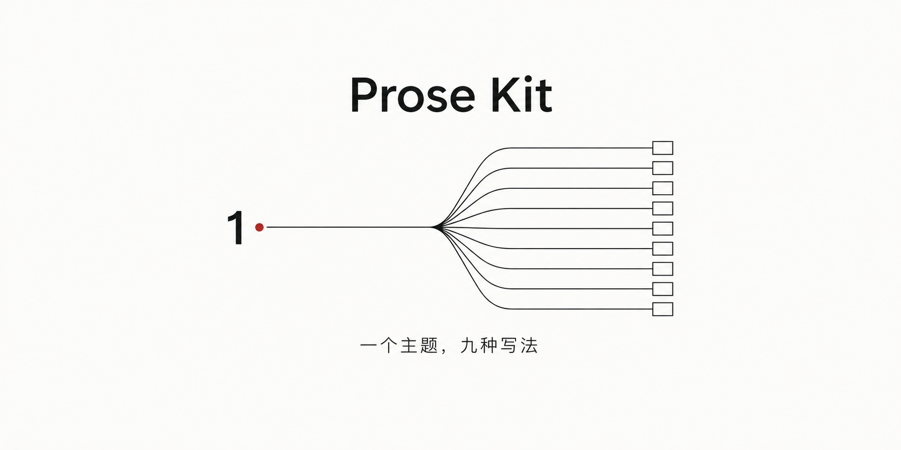

<p align="center">
  
</p>

<p align="center">
  <strong>一个主题，九种写法。</strong><br>
  Claude Code 驱动的中文散文生成系统。给一个主题，出 9 篇风格各异的草稿。
</p>

<p align="center">
  <a href="#快速上手">快速上手</a> ·
  <a href="#工作原理">工作原理</a> ·
  <a href="https://prose-kit.com/buy">完整版</a>
</p>

---

### 生成效果

主题：**龙**

> 那天晚上，我做了一个梦。
>
> 梦见我爷爷。他十七岁，站在村口，背着一个包袱，准备走。
>
> 我在旁边看着他。他看见我了。他问：你是谁？
>
> 我说：我是你孙子。
>
> 他笑了。他说：我还没结婚呢，哪来的孙子。
>
> ……
>
> 我在后面喊：你会碰到很多龙。
>
> 他没回头。他说：那就杀。
>
> 我喊：杀不完的。
>
> 他还是没回头。他说：那就一直杀。
>
> 我喊：你自己也可能变成龙。
>
> 他停下来了。他转过头，看着我。
>
> 他说：那就让人来杀我。
>
> 然后他走了。

这是 9 篇草稿中的一篇。同一个主题，另外 8 篇从完全不同的角度起笔。

---

### 工作原理

```
/write-essay 龙
      │
      ▼
  9 个种子（私人记忆 / 跨学科现象 / 问题 / 场景 / 第一句话）
      │
      ├── 第 1 轮：3 个 agent → 3 篇草稿
      ├── 第 2 轮：3 个 agent → 3 篇草稿（避开第 1 轮的隐喻和结构）
      └── 第 3 轮：3 个 agent → 3 篇草稿（累积避坑）
      │
      ▼
  9 篇草稿 → 浏览器阅读 → 挑最好的
```

每轮的 3 个 agent 用不同类型的种子起笔。轮次之间传递"避坑清单"，防止隐喻和结构撞车。

RAG 系统从你导入的文章库里检索风格最接近的参考文，让 agent 校准语感——写出来的是**你的声音**，不是 AI 的声音。

---

### 快速上手

```bash
# 安装依赖
bash setup.sh

# 配置你的写作声音（在 Claude Code 里）
/setup

# 导入你最好的几篇文章作为声音参考
python3 pipeline/scripts/rag_essays.py insert --md-file path/to/essay.md
python3 pipeline/scripts/rag_essays.py build-index
```

> ⚠️ 导入的 `.md` 文件头部需要 frontmatter：
> ```yaml
> ---
> id: "essay-001"
> tags: ["散文", "记忆"]
> title_zh: "文章标题"
> description_zh: "一句话简介"
> ---
> ```

```bash
# 开始生成
/write-essay 关于记忆的重量

# 浏览器阅读草稿
node studio/reader/server.cjs
# 打开 http://localhost:3749
```

---

### 包含什么

| 功能 | 说明 |
|------|------|
| `/write-essay` | 3 轮 × 3 并行 agent，9 篇不同角度的草稿 |
| `/setup` | 交互式声音配置，定义你的叙述者身份 |
| RAG 声音校准 | 语义检索 + 标签匹配（Ollama + nomic-embed-text） |
| Draft Reader | 浏览器里看草稿、编辑、收藏、入库 |

---

### 完整版

开源版已经能生成和阅读。完整版多了评分、发布和语料库：

| | 开源版 | Pro |
|---|:---:|:---:|
| 9 篇生成（3 轮 × 3） | ✅ | ✅ |
| RAG 声音校准 | ✅ | ✅ |
| Draft Reader | ✅ | ✅ |
| 自动评分（5 维度排名） | | ✅ |
| 完整世界观设定 | | ✅ |
| 100 篇实战散文语料 | | ✅ |
| 知乎/微信/小红书一键发布 | | ✅ |

👉 [prose-kit.com/buy](https://prose-kit.com/buy)

---

### 环境要求

- Python 3.8+
- Node.js 18+
- [Ollama](https://ollama.ai) + `nomic-embed-text`
- [Claude Code](https://claude.ai/claude-code) CLI

### 协议

MIT
